# DANNY'S DINNER SQL-CHALLENGE

I participated in this #8WeeeksOSqlChallenge. where i conducted an analysis on Danny's diner dataset.

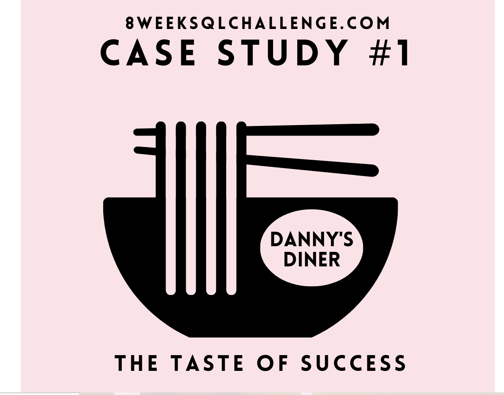

   #### INTRODUCTION
Danny seriously loves Japanese food so in the beginning of 2021, he decides to embark upon a risky venture and opens up a cute little restaurant that sells his 3 favourite foods: sushi, curry and ramen.

Danny’s Diner is in need of your assistance to help the restaurant stay afloat - the restaurant has captured some very basic data from their few months of operation but have no idea how to use their data to help them run the business.

  #### PROBLEM STATEMENT

  Danny wants to use the data to answer a few simple questions about his customers, especially about their visiting patterns, how much money they’ve spent and also which menu items are their favourite. Having this deeper connection with his customers will help him deliver a better and more personalised experience for his loyal customers.

He plans on using these insights to help him decide whether he should expand the existing customer loyalty program - additionally he needs help to generate some basic datasets so his team can easily inspect the data without needing to use SQL.

Danny has provided you with a sample of his overall customer data due to privacy issues - but he hopes that these examples are enough for you to write fully functioning SQL queries to help him answer his questions!

Danny has shared with you 3 key datasets for this case study:

*sales

*menu

*members

so i started by creating a database and tables with the dataset provided for the challange, adding the proper data type while populating it.

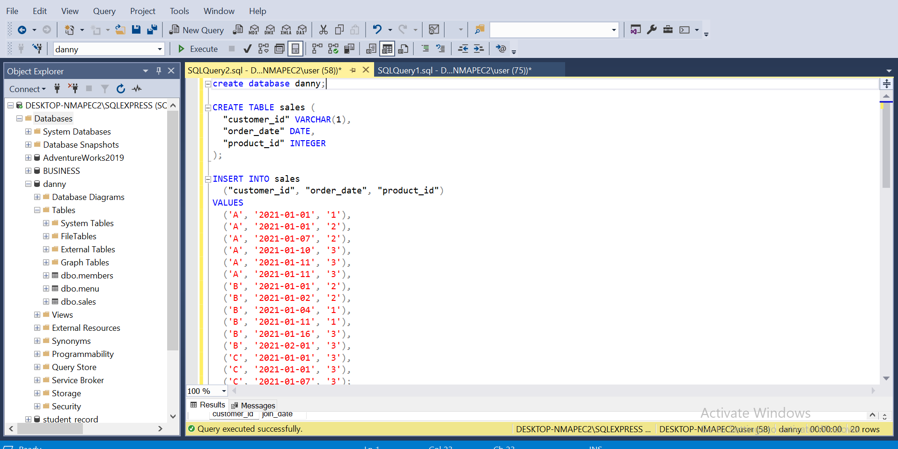
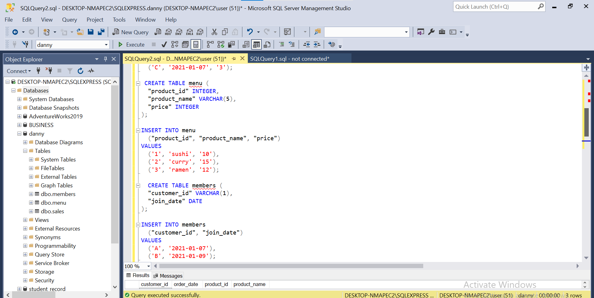
---

so these following questions were provided

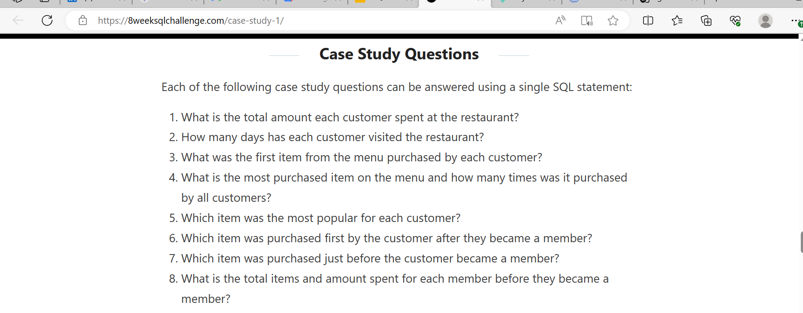

### Analysis

1. The total amount each customer spent at the restaurant.
   
   using this syntax i got the answer.

     "select customer_id, sum(price)  as amount_spent from menu m join sales s on 
   m.product_id = s.product_id
   group by customer_id;"
   
   so from the solution
customer A spent a total of $76,
customer B $74,and customer C spent $36
---

2. Number of days each customer visited the restaurant.

   i was able to query the database using this syntax.

    "select customer_id, count(distinct(order_date)) as days_visited from sales group by customer_id"

   customer A visited 4 times, customer B 6days and customer c 2days.

   ---

3. The first item purchased by each customer.
 i was able to answer this with two different queries. i used the windows function + subquery + joins and the Top number.

  select customer_id, product_name, rank_order from (select customer_id, product_name, order_date, dense_rank() over(partition by  customer_id order by order_date) as rank_order
 from sales s join menu m on s.product_id = m.product_id) as rank_table
                 where rank_order =1;
                 
                 
select top 5 customer_id, product_name, order_date from sales s join menu m on s.product_id= m.product_id
order by order_date;

both queries returned the same output, customer A purchased *SUSHI* and *CURRY* first, customer B purchased *CURRY* and customer C *RAMEN*.

---
4. Most purchased item and how many times it was purchased.
   
 
 i was also able to answer this with two different queries.

select product_name, count(order_date) as times_ordered from 
(select customer_id,product_name,order_date from menu m join sales s on m.product_id= s.product_id) as timesorederedtable
group by product_name
order by times_ordered desc;

select product_name, count(s.product_id) as times_purchased from sales s join menu m on s.product_id = m.product_id
group by product_name
order by times_purchased desc;

and both also returned the same answer. RAMEN was purchased eight times, followed by CURRY four times, and SUSHI three times.

---
5. Most popular item for each cutomer.
   
    i split this into three queries for each of the customer.

   ###### customer A
    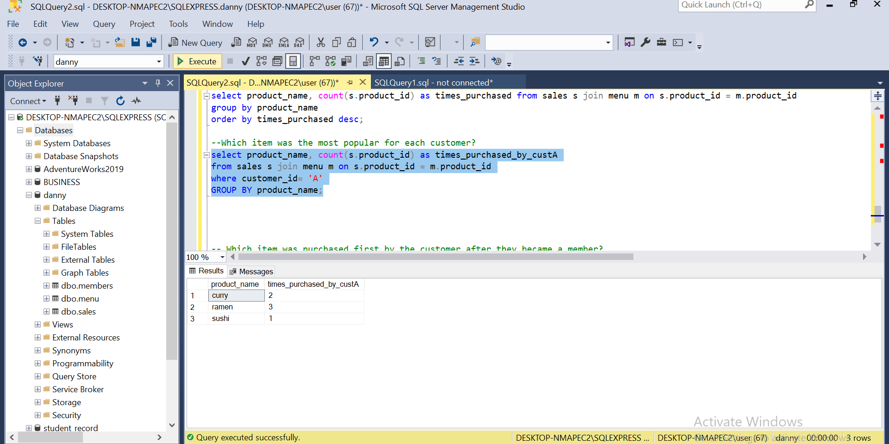
   *RAMEN* is the most popular item with customer C

   ###### customer B
   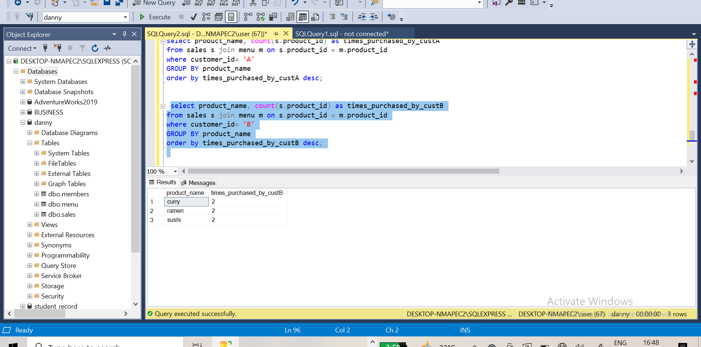
  For customer B, *RAMEN* and *SUSHI* are evenly distributed.

   ###### customer C
   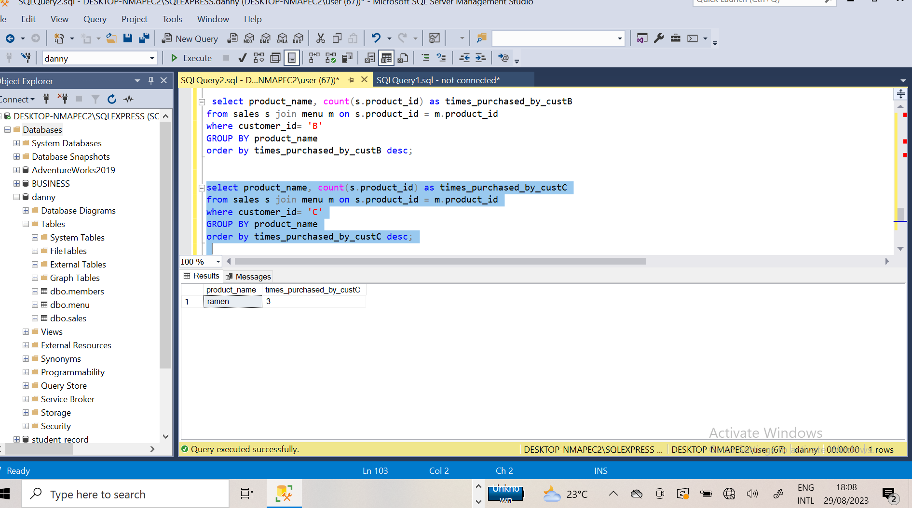
   customer C only purchased *RAMEN*

   from the above images, we can see the queries and syntaxes i used in answering the question, as well as the 
    solution.
   
   ---
6. First item purchased after membership

  ######  customer A
  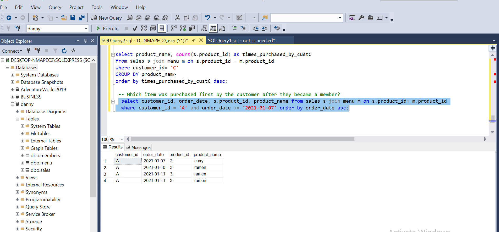
   The first item purchased by customer A after being a member is *CURRY*

   ###### customer B
   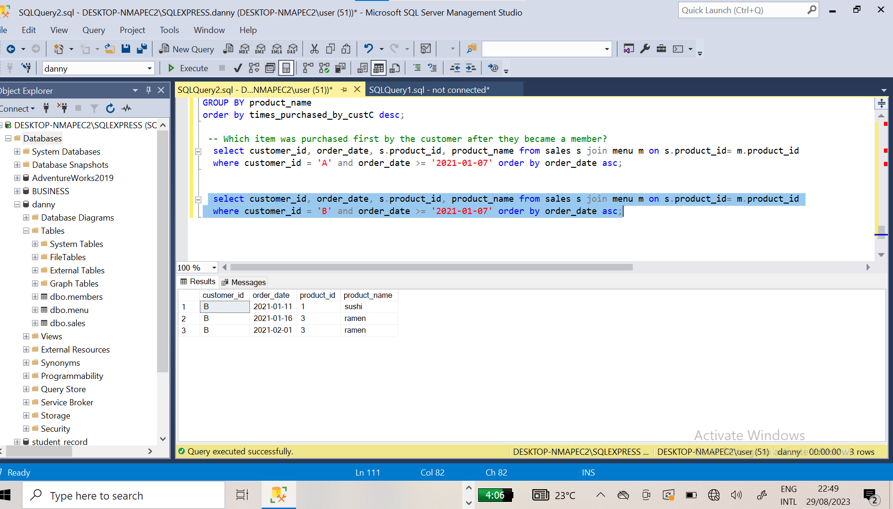
    The first item purchased by customer B after being a member is *SUSHI*

   ###### customer C
   customer C According to the MEMBER'S table is not a member so he did not buy anything after becoming a customer.

   ---

7. Last item purchased before membership
  ###### cutomer A
  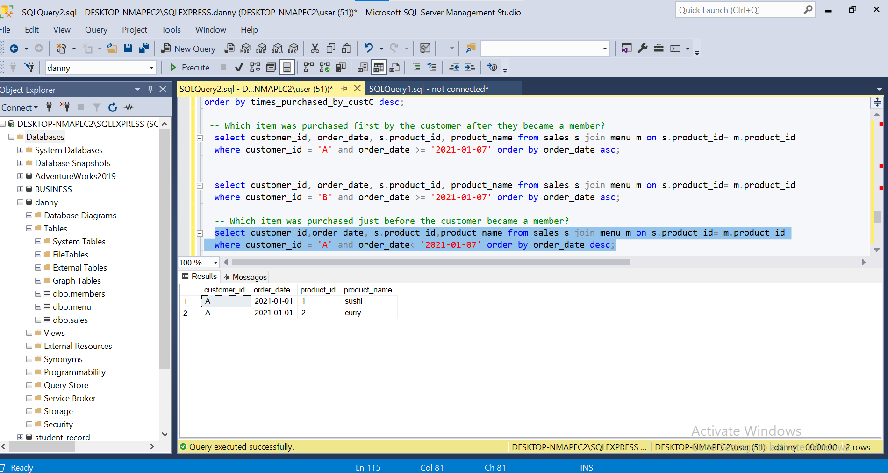
  The first item purchased by customer A after being a member is *SUSHI*

  ###### customer B
  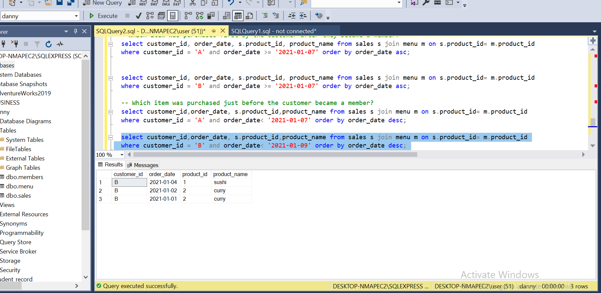
   The first item purchased by customer B after being a member is *SUSHI*

  ###### customer C

  according to the MEMBER'S table customer C is not a member so the item he bought after or before cannot be 
  determined

 ---
8. Total item and amount spent by each customer before membership.
###### customer A
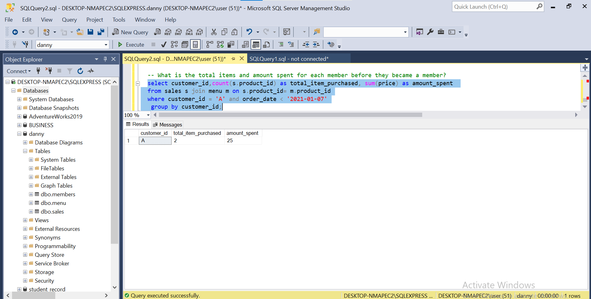
customer A purchased a total od 2 items summing up to $25 before becoming a member.

###### customer B
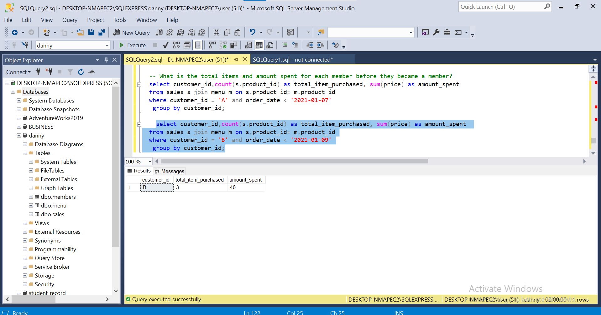
customer B purchased a total of 3 items summing up to $40 before becoming a member.

customer c is not a member

